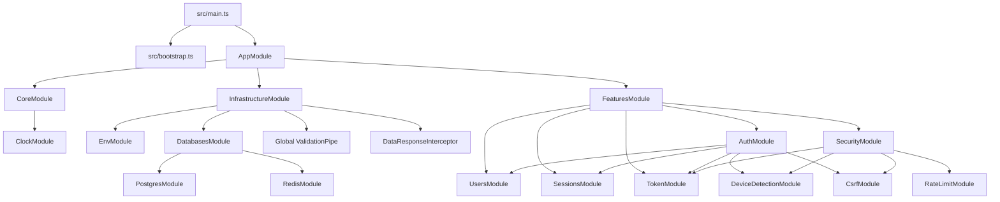

# Architecture

This document describes the architecture that exists in the current codebase. It is based on `src/`, configuration files, tests, Docker files, and package metadata.

## High-Level Shape

The application is a NestJS HTTP API with a feature-oriented source layout:

- `src/core`: shared primitives that are not tied to one feature.
- `src/infrastructure`: configuration, database connections, Redis, HTTP validation, serialization, response wrapping, and security headers.
- `src/features`: business modules for authentication, authorization/security, sessions, token handling, and users.

The root module is [src/app.module.ts](../src/app.module.ts):

```ts
@Module({
  imports: [CoreModule, InfrastructureModule, FeaturesModule]
})
export class AppModule {}
```

## Module Graph



## Bootstrap and Runtime Setup

Application startup begins in [src/main.ts](../src/main.ts):

- Creates a Nest application from `AppModule`.
- Calls `setupApp(app)` from [src/bootstrap.ts](../src/bootstrap.ts).
- Listens on port `8080`.

`setupApp()` configures:

- Swagger UI at `/api` only when `NODE_ENV === 'development'`.
- `helmetConfig` from [src/infrastructure/http/helmet.config.ts](../src/infrastructure/http/helmet.config.ts).
- Gzip compression through `compression`.
- URI-based versioning through `app.enableVersioning({ type: VersioningType.URI })`.
- Cookie parsing through `cookie-parser`.

There is no CORS setup in the current bootstrap code.

## Layer Responsibilities

### Core Layer

Files under [src/core](../src/core) provide small shared primitives:

- `ClockService`: time snapshot and date arithmetic for auth/session expiry.
- `TimeConstants`: millisecond constants.
- `AppError`, `ErrorMapper`, `ErrorDomain`, and domain error codes.
- Password and username validation regex rules.
- `RegistryDates`: base timestamp shape.

The current core layer is not fully framework-free because it includes Nest provider classes, but it is small and dependency-light.

### Infrastructure Layer

Files under [src/infrastructure](../src/infrastructure) provide application-wide adapters and HTTP infrastructure:

- `EnvModule`: global Nest Config setup with Joi validation.
- PostgreSQL TypeORM setup and migrations.
- Redis provider, service, counter service, and lock helper.
- Global `ValidationPipe` options.
- Global success response wrapping.
- Serialization interceptor and `@Serialize()` decorator.
- HTTP DTOs and validation field decorators.

`InfrastructureModule` registers:

- `APP_PIPE`: global `ValidationPipe`.
- `APP_INTERCEPTOR`: global `DataResponseInterceptor`.

### Features Layer

Files under [src/features](../src/features) contain user-facing behavior:

- `auth`: registration, login, refresh, password change, token cookies, password hashing provider.
- `security`: global guards, exception filter, CSRF, rate limiting, device detection.
- `sessions`: session persistence and session endpoints.
- `token`: JWT issuance, verification, payload validation.
- `users`: user persistence and profile/admin endpoints.

Feature modules communicate through Nest dependency injection. For example:

- `AuthService` depends on `UsersService`, `SessionsService`, `TokenService`, `ClockService`, `DeviceMapper`, `HashingProvider`, and `RedisLockService`.
- `TokenService` depends on `UsersService` and `SessionsService` to validate JWT payloads against current database state.
- `JwtGuard` depends on `JwtStrategy`, which delegates payload validation to `TokenService`.

## Cross-Cutting Request Behavior

Several behaviors are global:

- `DeviceMiddleware` attaches `request.device` for every route.
- `JwtGuard` protects all non-public routes.
- `RolesGuard` enforces `@Roles()` metadata where present.
- `RateLimitGuard` enforces `@RateLimit()` metadata where present.
- `CsrfGuard` validates unsafe methods unless `@SkipCsrf()` is present or the method is safe (`GET`, `HEAD`, `OPTIONS`).
- `ValidationPipe` validates and transforms DTOs.
- `DataResponseInterceptor` wraps successful responses as `{ data: ... }`.
- `GlobalExceptionFilter` wraps failures as `{ error: ... }`.

## Persistence Architecture

The application uses PostgreSQL through TypeORM:

- Runtime connection: [src/infrastructure/databases/postgres/postgres.module.ts](../src/infrastructure/databases/postgres/postgres.module.ts).
- Data source for migrations: [src/infrastructure/databases/postgres/data-source.ts](../src/infrastructure/databases/postgres/data-source.ts).
- Entities: `User` and `Session`.
- Migrations: [src/infrastructure/databases/postgres/migrations](../src/infrastructure/databases/postgres/migrations).

Redis is configured globally through [src/infrastructure/databases/redis/redis.module.ts](../src/infrastructure/databases/redis/redis.module.ts). It is used for rate-limit counters and a refresh-flow lock helper.

## Current Architectural Gaps

These are not assumptions; they are items not found or not fully implemented in the current code:

- No CORS configuration was found.
- No health, readiness, or metrics endpoints were found.
- No structured logging or audit-event module was found.
- No production Docker runtime stage was found.
- The development Docker Compose file does not currently match the application port or database host/name configuration.
- `RedisLockService.acquire()` uses `SET key value EX ttl` without `NX`, so it does not provide strict mutual exclusion.
- JWT verification does not configure issuer, audience, key rotation, or asymmetric signing.
