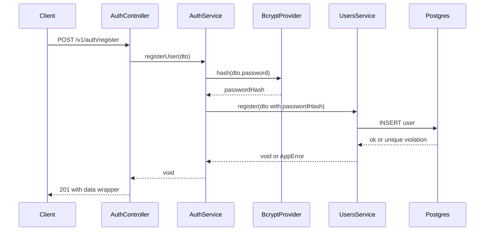
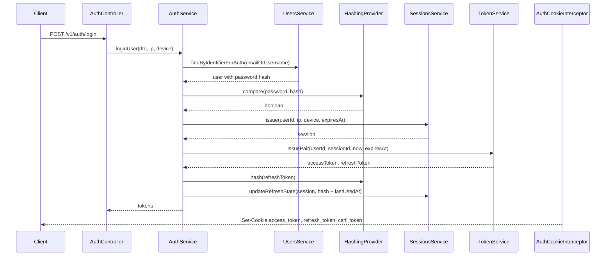

# Authentication

This document explains the authentication implementation in the current project.

## Relevant Files

- [src/features/auth/auth.controller.ts](../src/features/auth/auth.controller.ts)
- [src/features/auth/auth.service.ts](../src/features/auth/auth.service.ts)
- [src/features/auth/auth.module.ts](../src/features/auth/auth.module.ts)
- [src/features/auth/interceptors/auth-cookie.interceptor.ts](../src/features/auth/interceptors/auth-cookie.interceptor.ts)
- [src/features/auth/providers/bcrypt.provider.ts](../src/features/auth/providers/bcrypt.provider.ts)
- [src/features/auth/providers/hashing.provider.ts](../src/features/auth/providers/hashing.provider.ts)
- [src/features/token/token.service.ts](../src/features/token/token.service.ts)
- [src/features/security/strategies/jwt.strategy.ts](../src/features/security/strategies/jwt.strategy.ts)
- [src/features/security/guards/jwt.guard.ts](../src/features/security/guards/jwt.guard.ts)
- [src/features/sessions/sessions.service.ts](../src/features/sessions/sessions.service.ts)
- [src/features/users/users.service.ts](../src/features/users/users.service.ts)

## Authentication Model

The API uses cookie-based JWT authentication:

- `access_token`: short-lived JWT stored in an HTTP-only cookie.
- `refresh_token`: JWT stored in an HTTP-only cookie and also stored server-side as a bcrypt hash on the `Session` entity.
- `csrf_token`: readable cookie generated on login/refresh and expected in the `x-csrf-token` header for unsafe methods.

Access token lifetime is configured in code as 15 minutes in `TokenService.issuePair()`.

Refresh/session lifetime is 7 days from the current clock snapshot in `ClockService.snapshot()`.

JWT signing uses the symmetric `JWT_SECRET_KEY` environment variable through [src/infrastructure/config/jsonwebtoken/jwt.config.ts](../src/infrastructure/config/jsonwebtoken/jwt.config.ts). No issuer, audience, key rotation, or asymmetric signing configuration exists in the current code.

## Token Payloads

`TokenService.issuePair()` creates payloads with:

- `sub`: user ID.
- `sessionId`: session ID.
- `exp`: token expiration.
- `jti`: refresh token only.

`IJwtPayload` includes an optional `role`, but role is not currently written into issued tokens.

Authorization uses the loaded database user, not a JWT role claim.

## Registration Flow

Endpoint: `POST /v1/auth/register`

Decorators:

- `@Public()`
- `@RateLimit({ limit: 5, ttl: 60 })`
- `@SkipCsrf()`

Request DTO: [RegisterUserRequestDto](../src/features/auth/dto/request/register-user.request.dto.ts)

Fields:

- `email`: normalized to lowercase and validated as email.
- `username`: normalized to lowercase and validated by the username regex.
- `password`: validated by the password regex.

Flow:

Duplicate email and username database errors are mapped to domain errors in `UsersService.handleUniqueConstraintError()`.

## Login Flow

Endpoint: `POST /v1/auth/login`

Decorators:

- `@Public()`
- `@UseInterceptors(AuthCookieInterceptor)`
- `@RateLimit({ limit: 5, ttl: 60 })`
- `@SkipCsrf()`

Request DTO: [LoginUserRequestDto](../src/features/auth/dto/request/login-user.request.dto.ts)

Fields:

- `email`: accepts email or username, trims and lowercases.
- `password`: validated by `PasswordField()`.

Flow:

Cookies are set in `AuthCookieInterceptor`:

| Cookie | HttpOnly | Secure | SameSite | Max Age |
| --- | --- | --- | --- | --- |
| `access_token` | Yes | `true` in production | `strict` in production, `lax` otherwise | 15 minutes |
| `refresh_token` | Yes | `true` in production | `strict` in production, `lax` otherwise | 7 days |
| `csrf_token` | No | `true` in production | `strict` in production, `lax` otherwise | Not explicitly set |

## Authenticated Request Flow

For routes without `@Public()`:

1. `JwtGuard` reads the `access_token` cookie.
2. `JwtStrategy.authenticate()` verifies the token.
3. `TokenService.validatePayload()` loads the user through `UsersService.findByIdForSessionValidation()`.
4. `TokenService.validatePayload()` loads an active session through `SessionsService.getActive()`.
5. The guard attaches `request.user` and `request.session`.
6. `@User()` and `@Session()` decorators read those values in controllers.

If the token is missing, invalid, or the session is not active, a domain error is thrown and handled by `GlobalExceptionFilter`.

## Refresh Flow

Endpoint: `POST /v1/auth/refresh`

Decorators:

- `@Public()`
- `@UseInterceptors(AuthCookieInterceptor)`
- `@RateLimit({ limit: 20, ttl: 60 })`

CSRF is not skipped for this endpoint. Because it is a `POST`, clients must send:

- `csrf_token` cookie
- matching `x-csrf-token` header

Flow:

1. Controller reads `req.cookies.refresh_token`.
2. `AuthService.refresh()` verifies the refresh JWT.
3. Auth attempts to acquire a Redis refresh key by session ID.
4. The active session is loaded from PostgreSQL.
5. The presented refresh token is compared with `session.refreshTokenHash`.
6. If the hash does not match, the session is revoked and `SESSION_REUSE_DETECTED` is thrown.
7. If `session.rotatedAt >= refreshToken.iat`, reuse is detected and an error is thrown.
8. New access and refresh tokens are issued.
9. The new refresh token is hashed.
10. `SessionsService.rotateAtomic()` conditionally updates the session by `id`, current `refreshTokenHash`, and `version`.
11. If the update affects no rows, `SESSION_REUSE_DETECTED` is thrown.
12. `AuthCookieInterceptor` sets the new cookies.

Important implementation note: `RedisLockService.acquire()` does not currently use Redis `NX`, so it does not guarantee mutual exclusion. The database conditional update in `rotateAtomic()` is the stronger concurrency control in the current code.

## Change Password Flow

Endpoint: `POST /v1/auth/change-password`

Decorators:

- Authenticated by global `JwtGuard`.
- `@RateLimit({ limit: 3, ttl: 300 })`.
- CSRF required because the method is `POST` and the route does not use `@SkipCsrf()`.

Flow:

1. Current user and session come from `@User()` and `@Session()`.
2. `AuthService.changeUserPassword()` loads the user with password hash.
3. Current password is verified.
4. New password is compared against the old hash and must be different.
5. New password is hashed and stored.
6. All other sessions for the user are revoked through `SessionsService.terminateOthers()`.

The current session remains active.

## Authentication Gaps and Observations

- No logout endpoint exists under `auth`; session revocation is handled by `DELETE /v1/sessions`.
- Session revocation does not clear cookies in the current implementation.
- User `status` is selected during auth lookup but no status check is enforced in `AuthService.loginUser()`.
- Access tokens are invalidated by session lookup; a revoked session causes future access-token validation to fail.
- Refresh tokens are JWTs, not opaque random strings.
- Refresh token hashes use bcrypt, which is also used for passwords.
