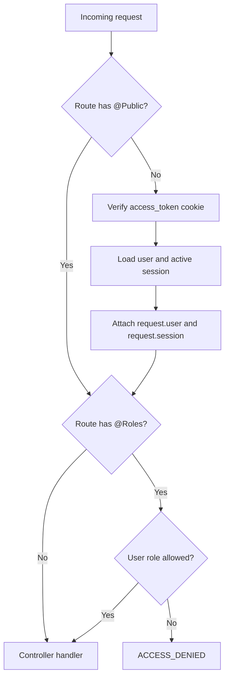

# Authorization

This document describes how access control works in the current project.

## Relevant Files

- [src/features/security/guards/jwt.guard.ts](../src/features/security/guards/jwt.guard.ts)
- [src/features/security/guards/roles.guard.ts](../src/features/security/guards/roles.guard.ts)
- [src/features/security/decorators/public.decorator.ts](../src/features/security/decorators/public.decorator.ts)
- [src/features/security/decorators/roles.decorator.ts](../src/features/security/decorators/roles.decorator.ts)
- [src/features/security/decorators/user.decorator.ts](../src/features/security/decorators/user.decorator.ts)
- [src/features/security/decorators/session.decorator.ts](../src/features/security/decorators/session.decorator.ts)
- [src/features/users/enums/user-role.enum.ts](../src/features/users/enums/user-role.enum.ts)
- [src/features/users/admin.users.controller.ts](../src/features/users/admin.users.controller.ts)

## Authentication Guard

`JwtGuard` is registered as an `APP_GUARD` in `SecurityModule`, making it global.

It checks for `@Public()` metadata:

```ts
export const IS_PUBLIC_KEY = 'isPublic';
export const Public = () => SetMetadata(IS_PUBLIC_KEY, true);
```

If a route is public, JWT validation is skipped. Otherwise:

1. The guard reads the request.
2. `JwtStrategy.authenticate(req)` verifies the `access_token` cookie.
3. `TokenService.validatePayload()` loads the user and active session.
4. `req.user` and `req.session` are populated.

Public routes in the current API:

- `POST /v1/auth/register`
- `POST /v1/auth/login`
- `POST /v1/auth/refresh`

## Role Guard

`RolesGuard` is also registered globally.

It reads `@Roles()` metadata:

```ts
export const ROLES_KEY = 'roles';
export const Roles = (...roles: UserRole[]) => SetMetadata(ROLES_KEY, roles);
```

If no roles are required, the guard allows the request. If roles are required:

1. It reads `request.user`.
2. It checks that the user has a role.
3. It verifies the role is included in the required role list.
4. If not, it throws `SecurityErrors.accessDenied()`.

Roles are loaded from the database user selected during JWT payload validation, not from the JWT payload.

## Role Values

Defined in [src/features/users/enums/user-role.enum.ts](../src/features/users/enums/user-role.enum.ts):

- `ADMIN`
- `USER`

`User` entity default role is `USER`.

## Admin Endpoints

[AdminUsersController](../src/features/users/admin.users.controller.ts) is decorated with:

```ts
@UseGuards(RolesGuard)
@Roles(UserRole.ADMIN)
```

The explicit `@UseGuards(RolesGuard)` is redundant because `RolesGuard` is already global, but it does not change the behavior.

Admin routes:

- `GET /v1/admin/users`
- `GET /v1/admin/users/:id`

Only users with role `ADMIN` can access them.

## Request Principal Decorators

Authenticated controllers use these parameter decorators:

- `@User()`: returns `request.user`.
- `@Session()`: returns `request.session`.

Both depend on `JwtGuard` having already attached those values.

## Authorization Flow



## Authorization Gaps

- No permission or scope model exists beyond `ADMIN` and `USER`.
- No route-level ownership checks exist beyond using the authenticated user's own `id` in user/session services.
- User `status` is loaded in some auth queries, but no authorization logic checks `ACTIVATE`, `DEACTIVATE`, or `SUSPEND`.
- No policy abstraction or ability-based authorization layer exists.
