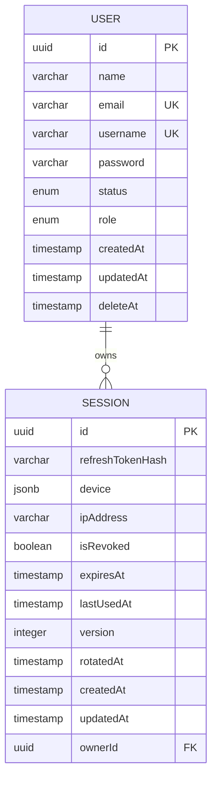

# Database

This document describes the PostgreSQL and TypeORM implementation.

## Relevant Files

- [src/infrastructure/config/databases/postgres.config.ts](../src/infrastructure/config/databases/postgres.config.ts)
- [src/infrastructure/databases/postgres/postgres.module.ts](../src/infrastructure/databases/postgres/postgres.module.ts)
- [src/infrastructure/databases/postgres/data-source.ts](../src/infrastructure/databases/postgres/data-source.ts)
- [src/infrastructure/databases/postgres/migrations](../src/infrastructure/databases/postgres/migrations)
- [src/features/users/entities/user.entity.ts](../src/features/users/entities/user.entity.ts)
- [src/features/sessions/entities/session.entity.ts](../src/features/sessions/entities/session.entity.ts)

## Runtime Configuration

`postgres.config.ts` builds a PostgreSQL URL from environment variables:

```text
postgresql://{DATA_SOURCE_USERNAME}:{DATA_SOURCE_PASSWORD}@{DATA_SOURCE_HOST}:{DATA_SOURCE_PORT}/{DATA_SOURCE_DATABASE}
```

Runtime TypeORM options:

- `type: 'postgres'`
- `autoLoadEntities: true`
- `url: ...`

`PostgresModule` registers this through `TypeOrmModule.forRootAsync()`.

## Migration Data Source

[data-source.ts](../src/infrastructure/databases/postgres/data-source.ts) is used by TypeORM migration scripts. It:

- Loads `.env` with `dotenv` and `dotenv-expand`.
- Uses the same PostgreSQL config factory.
- Sets `synchronize: false`.
- Sets `migrationsRun: false`.
- Loads entities from `dist/features/**/*.entity{.ts,.js}`.
- Loads migrations from `dist/infrastructure/databases/postgres/migrations/*{.ts,.js}`.

Because migration scripts point at `dist`, run `yarn build` before `yarn migration:run`.

## Schema Overview



## User Table

Defined by [User entity](../src/features/users/entities/user.entity.ts) and migrations.

Important constraints:

- Primary key: `id` UUID.
- Unique constraint: `users_email_unique` on `email`.
- Unique constraint: `users_username_unique` on `username`.
- `status` enum values: `ACTIVATE`, `DEACTIVATE`, `SUSPEND`.
- `role` enum values: `ADMIN`, `USER`.
- Soft delete timestamp: `deleteAt`.

Default values:

- `status`: `DEACTIVATE`.
- `role`: `USER`.

## Session Table

Defined by [Session entity](../src/features/sessions/entities/session.entity.ts) and migrations.

Important fields:

- `refreshTokenHash`: current hashed refresh token.
- `device`: JSONB session device snapshot.
- `ipAddress`: login IP address.
- `isRevoked`: server-side revocation flag.
- `expiresAt`: active-session expiry.
- `lastUsedAt`: latest usage timestamp.
- `version`: optimistic concurrency field for refresh rotation.
- `rotatedAt`: latest refresh-token rotation timestamp.
- `ownerId`: foreign key to `user.id`.

The entity defines `ManyToOne(() => User, (user) => user.sessions, { nullable: false })`.

## Migrations

Existing migration files:

| Migration | Purpose |
| --- | --- |
| `1767562475194-create-user-and-session-table.ts` | Creates user/session tables and user enums. |
| `1778584733796-AddSessionFields.ts` | Replaces initial token/device/IP/expiry columns with refresh/session lifecycle fields. |
| `1781203122645-RenameUserAgentToDevice.ts` | Renames/recreates session device column as JSONB. |
| `1781430797078-AddRotatedAtFieldOnSessionEntity.ts` | Adds `rotatedAt`. |
| `1782233299217-AddVersionFieldToSessionEntity.ts` | Adds `version` and index `IDX_session_id_version`. |

Migration commands:

```bash
yarn migration:create
yarn migration:generate
yarn migration:run
yarn migration:revert
yarn migration:show
```

## Important Migration Note

The first migration uses:

```sql
uuid_generate_v4()
```

No migration was found that enables the PostgreSQL `uuid-ossp` extension. Databases without that extension may fail when running the initial migration. Add an extension migration or enable the extension manually before running migrations.

## Repository Access Pattern

Services use `DataSource.getRepository()`:

- `UsersService.userRepo`
- `SessionsService.sessionRepo`

The modules import `TypeOrmModule.forFeature([User])` and `TypeOrmModule.forFeature([Session])`, but the services do not inject `Repository<T>` with `@InjectRepository()`.

## Current Database Gaps

- No migration creates the UUID extension.
- No explicit index was found for `session.ownerId`, although the foreign key exists.
- No pagination or filtering queries are implemented for admin user listing.
- No database-level checks were found for non-negative session version.
- TypeORM `synchronize` is not enabled in the migration data source, which is appropriate for migration-based schema management.
