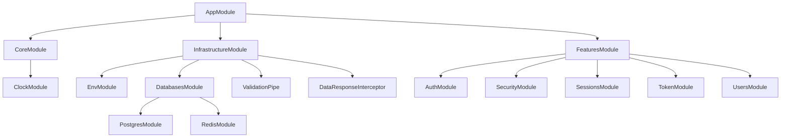
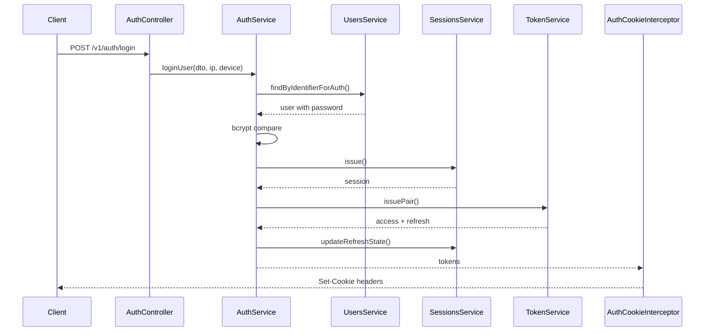
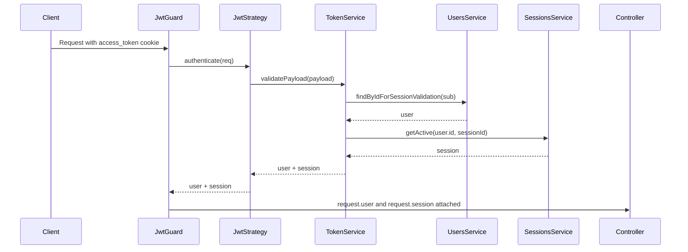
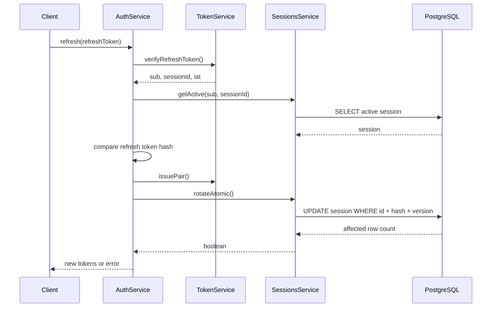
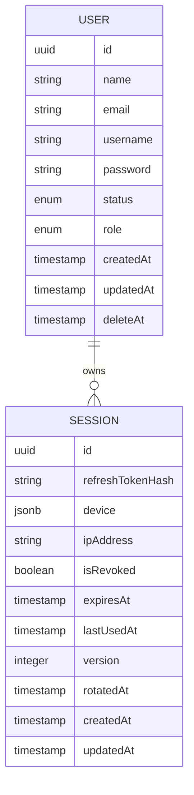
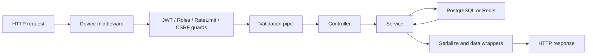

# Diagrams

This document collects diagrams for the current implementation.

## Module Composition

## Authentication Flow

## Authenticated Request Flow

## Refresh Rotation

## Entity Relationship

## Request Lifecycle

