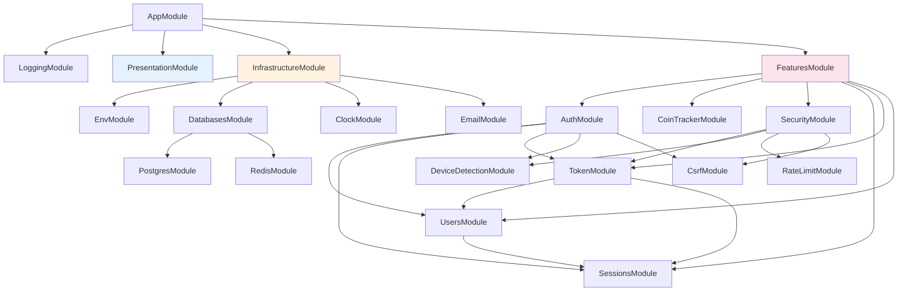
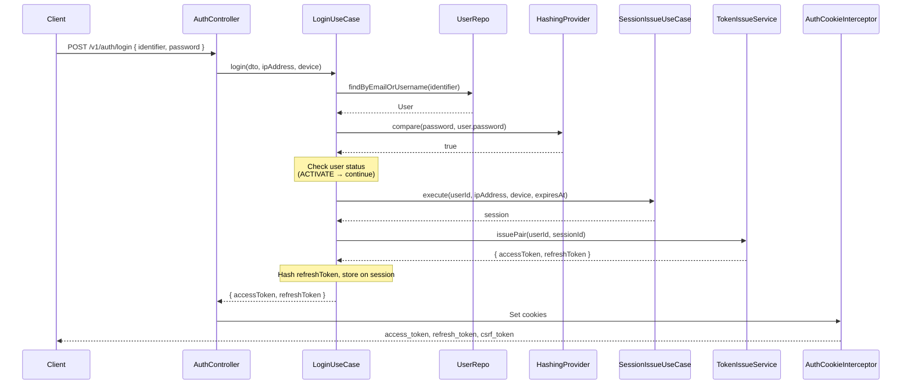
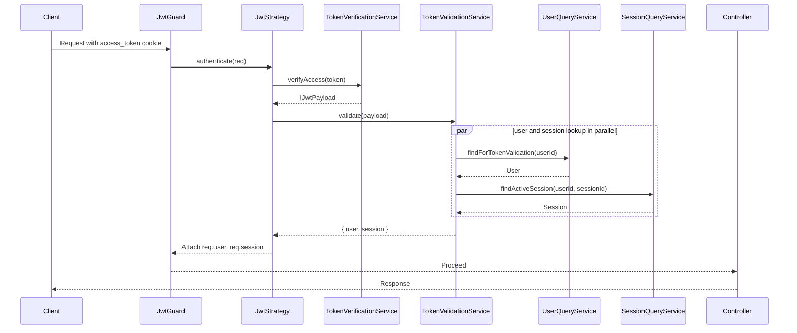
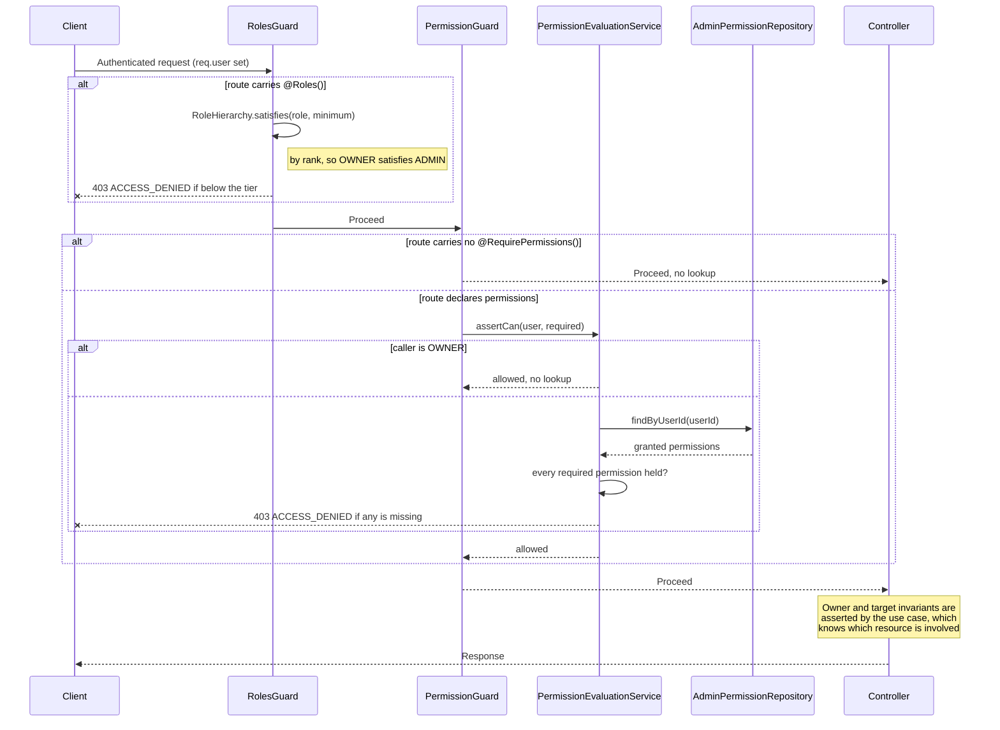
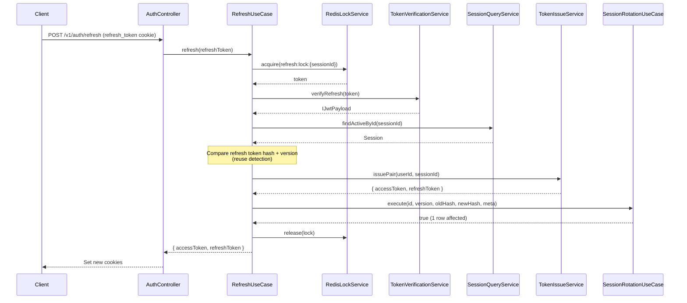
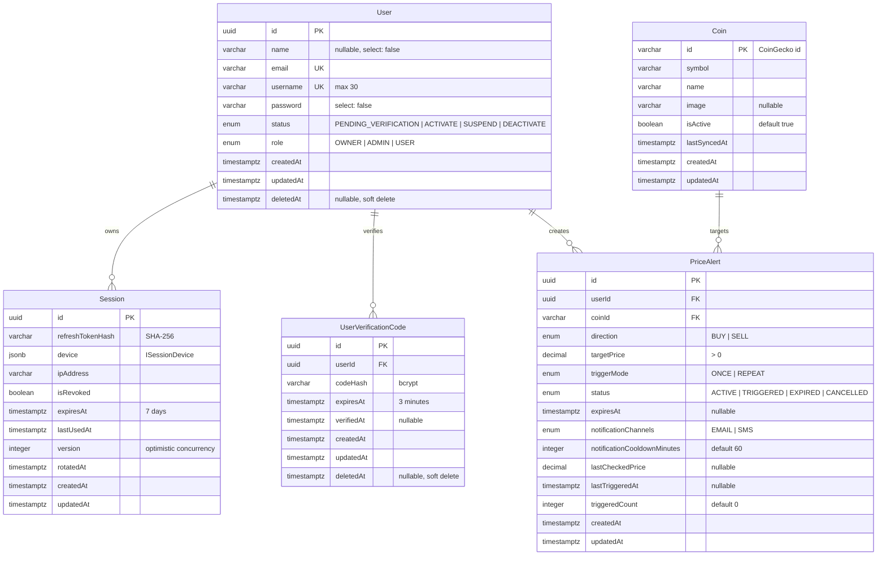
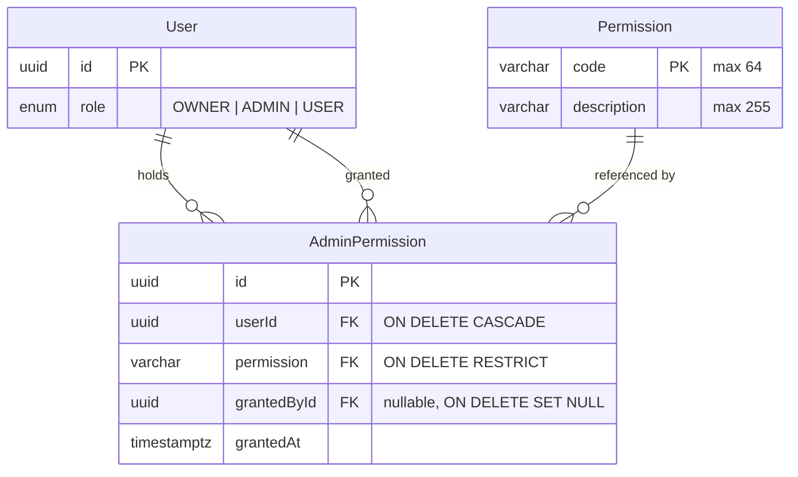
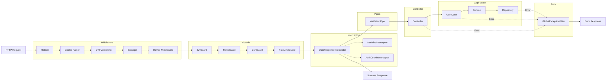
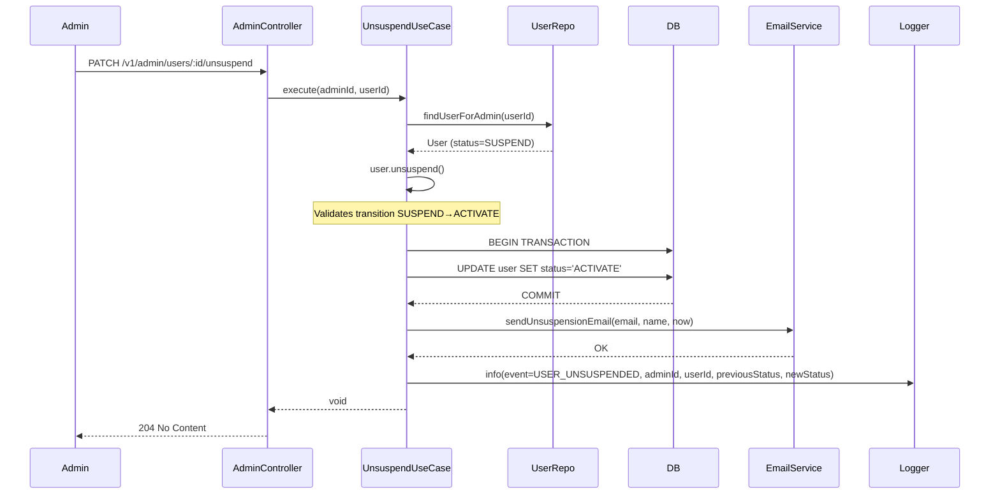

# Diagrams

## Module Composition

```mermaid
graph TB
    AppModule --> LoggingModule
    AppModule --> PresentationModule
    AppModule --> InfrastructureModule
    AppModule --> FeaturesModule

    InfrastructureModule --> EnvModule
    InfrastructureModule --> DatabasesModule
    InfrastructureModule --> ClockModule
    InfrastructureModule --> EmailModule

    DatabasesModule --> PostgresModule
    DatabasesModule --> RedisModule

    FeaturesModule --> AuthModule
    FeaturesModule --> CoinTrackerModule
    FeaturesModule --> SecurityModule
    FeaturesModule --> SessionsModule
    FeaturesModule --> TokenModule
    FeaturesModule --> UsersModule

    AuthModule --> UsersModule
    AuthModule --> SessionsModule
    AuthModule --> TokenModule
    AuthModule --> DeviceDetectionModule
    AuthModule --> CsrfModule

    TokenModule --> UsersModule
    TokenModule --> SessionsModule

    SecurityModule --> TokenModule
    SecurityModule --> DeviceDetectionModule
    SecurityModule --> RateLimitModule
    SecurityModule --> CsrfModule

    UsersModule --> SessionsModule

    style PresentationModule fill:#e3f2fd
    style InfrastructureModule fill:#fff3e0
    style FeaturesModule fill:#fce4ec
```

---

## Authentication Flow (Login)

```mermaid
sequenceDiagram
    participant Client
    participant AuthController
    participant LoginUseCase
    participant UserRepo
    participant HashingProvider
    participant SessionIssueUseCase
    participant TokenIssueService
    participant AuthCookieInterceptor

    Client->>AuthController: POST /v1/auth/login { identifier, password }
    AuthController->>LoginUseCase: login(dto, ipAddress, device)
    LoginUseCase->>UserRepo: findByEmailOrUsername(identifier)
    UserRepo-->>LoginUseCase: User

    LoginUseCase->>HashingProvider: compare(password, user.password)
    HashingProvider-->>LoginUseCase: true

    Note over LoginUseCase: Check user status<br/>(ACTIVATE → continue)

    LoginUseCase->>SessionIssueUseCase: execute(userId, ipAddress, device, expiresAt)
    SessionIssueUseCase-->>LoginUseCase: session

    LoginUseCase->>TokenIssueService: issuePair(userId, sessionId)
    TokenIssueService-->>LoginUseCase: { accessToken, refreshToken }

    Note over LoginUseCase: Hash refreshToken, store on session

    LoginUseCase-->>AuthController: { accessToken, refreshToken }
    AuthController->>AuthCookieInterceptor: Set cookies
    AuthCookieInterceptor-->>Client: access_token, refresh_token, csrf_token
```

---

## Authenticated Request Flow

```mermaid
sequenceDiagram
    participant Client
    participant JwtGuard
    participant JwtStrategy
    participant TokenVerificationService
    participant TokenValidationService
    participant UserQueryService
    participant SessionQueryService
    participant Controller

    Client->>JwtGuard: Request with access_token cookie
    JwtGuard->>JwtStrategy: authenticate(req)
    JwtStrategy->>TokenVerificationService: verifyAccess(token)
    TokenVerificationService-->>JwtStrategy: IJwtPayload

    JwtStrategy->>TokenValidationService: validate(payload)
    par user and session lookup in parallel
        TokenValidationService->>UserQueryService: findForTokenValidation(userId)
        UserQueryService-->>TokenValidationService: User
        TokenValidationService->>SessionQueryService: findActiveSession(userId, sessionId)
        SessionQueryService-->>TokenValidationService: Session
    end

    TokenValidationService-->>JwtStrategy: { user, session }

    JwtStrategy-->>JwtGuard: Attach req.user, req.session
    JwtGuard-->>Controller: Proceed
    Controller-->>Client: Response
```

---

## Authorization Flow

```mermaid
sequenceDiagram
    participant Client
    participant RolesGuard
    participant PermissionGuard
    participant PermissionEvaluationService
    participant AdminPermissionRepository
    participant Controller

    Client->>RolesGuard: Authenticated request (req.user set)

    alt route carries @Roles()
        RolesGuard->>RolesGuard: RoleHierarchy.satisfies(role, minimum)
        Note right of RolesGuard: by rank, so OWNER satisfies ADMIN
        RolesGuard--xClient: 403 ACCESS_DENIED if below the tier
    end

    RolesGuard->>PermissionGuard: Proceed

    alt route carries no @RequirePermissions()
        PermissionGuard-->>Controller: Proceed, no lookup
    else route declares permissions
        PermissionGuard->>PermissionEvaluationService: assertCan(user, required)

        alt caller is OWNER
            PermissionEvaluationService-->>PermissionGuard: allowed, no lookup
        else
            PermissionEvaluationService->>AdminPermissionRepository: findByUserId(userId)
            AdminPermissionRepository-->>PermissionEvaluationService: granted permissions
            PermissionEvaluationService->>PermissionEvaluationService: every required permission held?
            PermissionEvaluationService--xClient: 403 ACCESS_DENIED if any is missing
        end

        PermissionEvaluationService-->>PermissionGuard: allowed
    end

    PermissionGuard-->>Controller: Proceed
    Note over Controller: Owner and target invariants are<br/>asserted by the use case, which<br/>knows which resource is involved
    Controller-->>Client: Response
```

---

## Refresh Rotation

```mermaid
sequenceDiagram
    participant Client
    participant AuthController
    participant RefreshUseCase
    participant RedisLockService
    participant TokenVerificationService
    participant SessionQueryService
    participant TokenIssueService
    participant SessionRotationUseCase

    Client->>AuthController: POST /v1/auth/refresh (refresh_token cookie)
    AuthController->>RefreshUseCase: refresh(refreshToken)

    RefreshUseCase->>RedisLockService: acquire(refresh:lock:{sessionId})
    RedisLockService-->>RefreshUseCase: token

    RefreshUseCase->>TokenVerificationService: verifyRefresh(token)
    TokenVerificationService-->>RefreshUseCase: IJwtPayload

    RefreshUseCase->>SessionQueryService: findActiveById(sessionId)
    SessionQueryService-->>RefreshUseCase: Session

    Note over RefreshUseCase: Compare refresh token hash + version<br/>(reuse detection)

    RefreshUseCase->>TokenIssueService: issuePair(userId, sessionId)
    TokenIssueService-->>RefreshUseCase: { accessToken, refreshToken }

    RefreshUseCase->>SessionRotationUseCase: execute(id, version, oldHash, newHash, meta)
    SessionRotationUseCase-->>RefreshUseCase: true (1 row affected)

    RefreshUseCase->>RedisLockService: release(lock)
    RefreshUseCase-->>AuthController: { accessToken, refreshToken }
    AuthController-->>Client: Set new cookies
```

---

## Entity Relationship

```mermaid
erDiagram
    User ||--o{ Session : owns
    User ||--o{ UserVerificationCode : verifies
    User ||--o{ PriceAlert : creates
    Coin ||--o{ PriceAlert : targets

    User {
        uuid id PK
        varchar name "nullable, select: false"
        varchar email UK
        varchar username UK "max 30"
        varchar password "select: false"
        enum status "PENDING_VERIFICATION | ACTIVATE | SUSPEND | DEACTIVATE"
        enum role "OWNER | ADMIN | USER"
        timestamptz createdAt
        timestamptz updatedAt
        timestamptz deletedAt "nullable, soft delete"
    }

    Session {
        uuid id PK
        varchar refreshTokenHash "SHA-256"
        jsonb device "ISessionDevice"
        varchar ipAddress
        boolean isRevoked
        timestamptz expiresAt "7 days"
        timestamptz lastUsedAt
        integer version "optimistic concurrency"
        timestamptz rotatedAt
        timestamptz createdAt
        timestamptz updatedAt
    }

    UserVerificationCode {
        uuid id PK
        uuid userId FK
        varchar codeHash "bcrypt"
        timestamptz expiresAt "3 minutes"
        timestamptz verifiedAt "nullable"
        timestamptz createdAt
        timestamptz updatedAt
        timestamptz deletedAt "nullable, soft delete"
    }

    Coin {
        varchar id PK "CoinGecko id"
        varchar symbol
        varchar name
        varchar image "nullable"
        boolean isActive "default true"
        timestamptz lastSyncedAt
        timestamptz createdAt
        timestamptz updatedAt
    }

    PriceAlert {
        uuid id PK
        uuid userId FK
        varchar coinId FK
        enum direction "BUY | SELL"
        decimal targetPrice "> 0"
        enum triggerMode "ONCE | REPEAT"
        enum status "ACTIVE | TRIGGERED | EXPIRED | CANCELLED"
        timestamptz expiresAt "nullable"
        enum notificationChannels "EMAIL | SMS"
        integer notificationCooldownMinutes "default 60"
        decimal lastCheckedPrice "nullable"
        timestamptz lastTriggeredAt "nullable"
        integer triggeredCount "default 0"
        timestamptz createdAt
        timestamptz updatedAt
    }
```

---

## Authorization Model

```mermaid
erDiagram
    User ||--o{ AdminPermission : "holds"
    User ||--o{ AdminPermission : "granted"
    Permission ||--o{ AdminPermission : "referenced by"

    User {
        uuid id PK
        enum role "OWNER | ADMIN | USER"
    }

    Permission {
        varchar code PK "max 64"
        varchar description "max 255"
    }

    AdminPermission {
        uuid id PK
        uuid userId FK "ON DELETE CASCADE"
        varchar permission FK "ON DELETE RESTRICT"
        uuid grantedById FK "nullable, ON DELETE SET NULL"
        timestamptz grantedAt
    }
```

`Permission` is reference data seeded by migration. `AdminPermission` is unique
on `(userId, permission)`. At most one `User` may hold `OWNER`, enforced by the
partial unique index `uq_user_single_owner`.

---

## Request Lifecycle

```mermaid
flowchart LR
    REQ[HTTP Request]

    subgraph Middleware
        H[Helmet]
        CP[Cookie Parser]
        UV[URI Versioning]
        SW[Swagger]
        DM[Device Middleware]
    end

    subgraph Guards
        JG[JwtGuard]
        RG[RolesGuard]
        CG[CsrfGuard]
        RLG[RateLimitGuard]
    end

    subgraph Interceptors
        DRI[DataResponseInterceptor]
        SI[SerializeInterceptor]
        ACI[AuthCookieInterceptor]
    end

    subgraph Pipes
        VP[ValidationPipe]
    end

    subgraph Controller
        C[Controller]
    end

    subgraph Application
        UC[Use Case]
        S[Service]
        R[Repository]
    end

    subgraph Error
        EF[GlobalExceptionFilter]
    end

    REQ --> H --> CP --> UV --> SW --> DM
    DM --> JG --> RG --> CG --> RLG
    RLG --> DRI --> VP --> C
    C --> UC --> S --> R
    DRI -.-> SI
    DRI -.-> ACI
    R -.->|Error| EF
    C -.->|Error| EF
    UC -.->|Error| EF
    EF --> RESP[Error Response]
    DRI --> RESP2[Success Response]
```

---

## Unsuspend Flow

```mermaid
sequenceDiagram
    participant Admin
    participant AdminController
    participant UnsuspendUseCase
    participant UserRepo
    participant DB
    participant EmailService
    participant Logger

    Admin->>AdminController: PATCH /v1/admin/users/:id/unsuspend
    AdminController->>UnsuspendUseCase: execute(adminId, userId)

    UnsuspendUseCase->>UserRepo: findUserForAdmin(userId)
    UserRepo-->>UnsuspendUseCase: User (status=SUSPEND)

    UnsuspendUseCase->>UnsuspendUseCase: user.unsuspend()
    Note over UnsuspendUseCase: Validates transition SUSPEND→ACTIVATE

    UnsuspendUseCase->>DB: BEGIN TRANSACTION
    UnsuspendUseCase->>DB: UPDATE user SET status='ACTIVATE'
    DB-->>UnsuspendUseCase: COMMIT

    UnsuspendUseCase->>EmailService: sendUnsuspensionEmail(email, name, now)
    EmailService-->>UnsuspendUseCase: OK

    UnsuspendUseCase->>Logger: info(event=USER_UNSUSPENDED, adminId, userId, previousStatus, newStatus)
    UnsuspendUseCase-->>AdminController: void
    AdminController-->>Admin: 204 No Content
```
