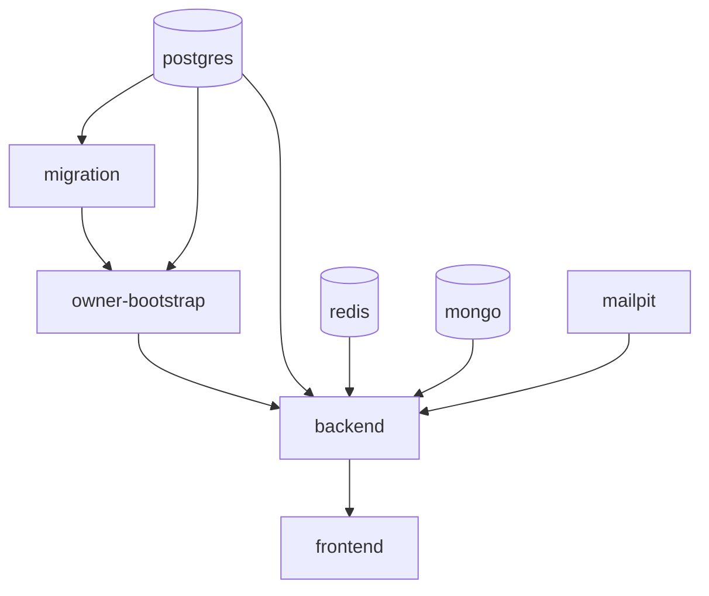

# Docker

Two distinct Compose stacks serve two distinct purposes. Confusing them is the
most common source of "it works locally" — they publish different ports, run
different images, and answer to different environment.

| Stack | File | Purpose |
|-------|------|---------|
| **Development** | `docker/compose.yml` (repository root) | Full app: frontend, backend, databases, Mailpit, migrations, owner bootstrap. Source-mounted, hot reload |
| **Docker E2E** | `nest-backend/docker/test/e2e/docker-compose.yml` | The CI-shaped backend E2E lane. No frontend, no source mount, no host-published Mailpit |

Related: [testing.md](testing.md), [ci.md](ci.md), [email.md](email.md),
[configuration.md](configuration.md), [deployment.md](deployment.md).

## Development stack

```bash
docker compose -f docker/compose.yml up -d
```

### Services



| Service | Image | Host port | Container port |
|---------|-------|-----------|----------------|
| `frontend` | `dashboard-dev-frontend` (built) | `3000` | 3000 |
| `backend` | `dashboard-dev-backend` (built) | `8080` | 8080 |
| `postgres` | `postgres:17-alpine` | `5442` | 5432 |
| `redis` | `redis:7-alpine` | `6382` | 6379 |
| `mongo` | `mongo:7-jammy` | `27019` | 27017 |
| `mailpit` | `axllent/mailpit:v1.28` | `1025`, `8025` | 1025 (SMTP), 8025 (HTTP) |
| `migration` | `dashboard-dev-backend` | — | run-to-completion |
| `owner-bootstrap` | `dashboard-dev-backend` | — | run-to-completion |

Every host port is overridable: `FRONTEND_HOST_PORT`, `BACKEND_HOST_PORT`,
`POSTGRES_HOST_PORT`, `REDIS_HOST_PORT`, `MONGO_HOST_PORT`,
`MAILPIT_SMTP_HOST_PORT`, `MAILPIT_WEB_HOST_PORT`.

The database ports are **offset from their defaults on purpose** — 5442 rather
than 5432, 6382 rather than 6379, 27019 rather than 27017 — so a locally
installed Postgres, Redis, or MongoDB keeps its own port and the two never
collide.

### Startup ordering

`migration` and `owner-bootstrap` are run-to-completion services, not daemons.
The chain is enforced with Compose conditions rather than sleeps:

1. `postgres` reaches `service_healthy`.
2. `migration` runs TypeORM migrations and exits 0.
3. `owner-bootstrap` seeds the owner account (idempotent) and exits 0.
4. `backend` starts, gated on `service_completed_successfully` for the two
   above and `service_healthy` for `postgres`, `redis`, `mongo`, and `mailpit`.
5. `frontend` starts, gated on `backend`.

### Healthchecks

| Service | Probe |
|---------|-------|
| `postgres` | `pg_isready -U postgres -d <db>` |
| `redis` | `redis-cli ping` |
| `mongo` | `mongosh --eval "db.runCommand({ ping: 1 }).ok"` |
| `mailpit` | `/mailpit readyz` |

All use a 5s interval, 3s timeout, 20 retries.

### Source mounting

`../nest-backend/src` and the frontend source are bind-mounted so edits reload
without a rebuild. `node_modules`, `dist`, and the Next.js cache are named
volumes so the container's installed dependencies are not shadowed by the host's.

### Owner bootstrap

`docker/bootstrap-owner.sh` seeds the account the integration and topology
Playwright lanes sign in as. It is idempotent:

```bash
docker/bootstrap-owner.sh owner@example.com 'DevOwner!123'
```

### How the backend reaches Mailpit inside Docker

By **Compose service name**, never through a published host port:

```
EMAIL_HOST=mailpit
EMAIL_PORT=1025
EMAIL_SECURE=false
```

The published `1025`/`8025` exist for the host — the Mailpit web UI at
`http://localhost:8025`, and a backend E2E run executing on the host rather than
in a container (see `nest-backend/.env.test`, which names `localhost`). Inside
the network the service name is what resolves. See [email.md](email.md).

## Docker E2E stack

```bash
cd nest-backend
export COMPOSE_FILE=docker/test/e2e/docker-compose.yml
docker compose up -d --wait postgres redis mongo mailpit
docker compose run --rm --no-deps migration
docker compose run --rm --no-deps app
docker compose down -v
```

This is exactly what CI runs. The Compose project name is `e2e`.

### Services

| Service | Image | Host port | Container port |
|---------|-------|-----------|----------------|
| `app` | `nest-backend-e2e-app` (Dockerfile target `test`) | — | — |
| `migration` | `nest-backend-e2e-migration` (target `production`) | — | run-to-completion |
| `postgres` | `postgres:17-alpine` | `5433` | 5432 |
| `redis` | `redis:7-alpine` | `6380` | 6379 |
| `mongo` | `mongo:7-jammy` | `27018` | 27017 |
| `mailpit` | `axllent/mailpit:v1.28` | **not published** | 1025, 8025 |

Mailpit is intentionally unpublished here: CI reaches it as `mailpit` on the
Compose network, and the run is the only thing that should be reading that
mailbox.

Note the ports differ from the development stack (5433/6380/27018 versus
5442/6382/27019), so both stacks can be up at once.

### Images

Two targets from the same `nest-backend/Dockerfile`:

- **`production`** — the runtime image. Runs as the `node` user, `NODE_ENV=production`,
  `CMD ["node","dist/main.js"]`, pruned production dependencies plus `dist`. Also
  tagged as the Compose `migration` image so migrations run against the same
  artifact that ships.
- **`test`** — full dependency set plus the whole source tree. The E2E suite is
  compiled on the fly by ts-jest and imports from `src`, so it never reads
  `dist`; building first only added a redundant compile.

### Environment

The `app` service sets the databases (`test_e2e_db`, `test_e2e_logs`), Redis,
test-only token secrets, `CORS_ORIGIN`, Mailpit as the SMTP target, and the Jest
worker count. Per-worker isolation is derived at runtime: `test/setup/worker-env.ts`
gives every Jest worker its own Postgres database, Redis database index, and
MongoDB database.

### Worker configuration

```
E2E_MAX_WORKERS=2
```

Set on the `app` service. This is a **memory-safety choice for Docker CI**, not
a universally optimal value.

Each Jest worker boots a whole Nest application — Postgres pool, Redis, Mongo,
BullMQ — and Node sizes each worker's heap from the machine's *total* memory, so
workers each grow as though they owned the box rather than a share of it.
Measured against this suite at roughly 1.9 GB resident per worker: 2 workers peak
near 3.9 GB and 3 near 5.2 GB, while 4 or more exhaust an 8 GB Docker host badly
enough that the kernel SIGKILLs workers mid-`beforeAll`. Jest reports that as
`Test suite failed to run` and hook timeouts, which reads like a flaky
application and is not one.

Two is the highest count that still leaves headroom on a GitHub Actions standard
runner (2 vCPU / 7 GB). A host with more memory can raise it —
`E2E_MAX_WORKERS` is read by `jest.e2e.config.ts`, validated, and capped at the
15 usable Redis databases (one per worker). It is not a claim that 2 is optimal
anywhere else. See [ci.md](ci.md).

## Which stack for which job

| Task | Stack |
|------|-------|
| Day-to-day development, frontend + backend | Development |
| Frontend Playwright integration lane | Development (plus `bootstrap-owner.sh`) |
| Frontend Playwright topology lane | Development, started with `COOKIE_DOMAIN` and `app.`/`api.` origins |
| Backend E2E on the host | Development stack for the databases + Mailpit, then `pnpm run test:e2e` |
| Reproducing a CI E2E failure | Docker E2E |
