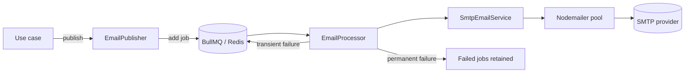

# Email

How the backend renders, queues, and delivers mail, and what changes between
production, development, and the E2E lanes.

Related: [testing.md](testing.md) for the Mailpit E2E lane,
[docker.md](docker.md) for the Mailpit container,
[configuration.md](configuration.md) for the environment variables,
[authentication.md](authentication.md) for the verification-code flow that
sends the first of these emails.

## Architecture

```
Application (use case)
   ↓  publish(message, dedupeKey)
EmailPublisher  →  BullMQ queue (Redis)
   ↓
EmailProcessor         worker; retries and classifies failures
   ↓
SmtpEmailService       renders subject/html/text, then hands off
   ↓
Nodemailer             pooled SMTP transport
   ↓
SMTP provider          Gmail in production, Mailpit locally and in E2E
```

Nothing in a request path talks to SMTP. A use case publishes a message and
returns; delivery happens on the queue worker. That is what keeps a slow or
broken mail provider from holding an HTTP response open, and it is why a
delivery failure never fails the request that triggered it.



### Publishing is bounded

`EMAIL_QUEUE_PUBLISH_TIMEOUT_MS` (default 2000) caps how long publishing may
block. ioredis buffers commands while it reconnects, so without the ceiling an
unreachable Redis would hold an HTTP response open instead of dropping one
email.

### Deduplication

`emailDedupeKey(type, ...parts)` in
`src/infrastructure/email/email-dedupe.key.ts` builds the BullMQ job id.
Publishing the same key twice sends one email, so the key names the *occasion* —
the row that recorded the issued code, the invitation being delivered, the
instant an account changed state — rather than describing it.

Keys become Redis key names and appear in queue dashboards. A verification code,
an invitation token, or any other secret must never be part of one.

The message type prefixes every key because job ids share one namespace per
queue, and `.` separates the parts because BullMQ reserves `:` in custom job ids.

## Email types

Five, enumerated by `EmailMessageType` in
`src/infrastructure/email/email.message.ts`:

| Type | Wire value | Sent when |
|------|-----------|-----------|
| `VERIFICATION` | `verification` | Registration and resend-verification; carries the code and its expiry in minutes |
| `ADMIN_INVITATION` | `admin-invitation` | An administrator invitation is created; carries the invitation token and expiry in hours |
| `SUSPENSION` | `suspension` | An account is suspended; carries the reason and the instant |
| `UNSUSPENSION` | `unsuspension` | A suspended account is restored |
| `PRICE_ALERT` | `price-alert` | The price-check scheduler triggers an alert; carries coin, direction, target and current price |

Templates live in `src/infrastructure/email/email.template.ts` and render a
`{ subject, html, text }` triple. Every interpolated value passes through
`escapeHtml`. `APP_NAME` is rendered into subjects and bodies as `projectName`.

## Production

Gmail SMTP is the provider the project is configured for (`.env.example`).
Nothing in the code is Gmail-specific — there is one SMTP implementation and it
does not know which server answered — so any SMTP provider works by changing the
environment alone.

Configuration is entirely environment-driven. Values below are **names only**;
never commit real ones.

| Variable | Purpose |
|----------|---------|
| `EMAIL_HOST` | SMTP hostname (`smtp.gmail.com` for Gmail) |
| `EMAIL_PORT` | SMTP port; `587` for STARTTLS submission |
| `EMAIL_SECURE` | `true` = implicit TLS from the first byte (port 465). `false` = plain connect, then STARTTLS upgrade (port 587) |
| `EMAIL_USER` | SMTP account the transport authenticates as |
| `EMAIL_APP_PASSWORD` | **Secret.** Gmail requires an App Password, not the account password |
| `EMAIL_FROM` | Envelope/display sender, e.g. `Name <no-reply@example.com>` |
| `APP_NAME` | Rendered into subjects and bodies |

### TLS

`EMAIL_SECURE` maps directly onto nodemailer's `secure` flag:

- `EMAIL_SECURE=true` with port 465 — TLS is negotiated before SMTP begins.
- `EMAIL_SECURE=false` with port 587 — the connection starts plaintext and
  upgrades via STARTTLS. This is the documented Gmail configuration and is **not**
  an unencrypted session; the upgrade is what the submission port expects.

`EMAIL_SECURE=false` against a server with no STARTTLS support would leave
credentials in the clear. That is only the case for Mailpit, which is local-only
and accepts any credentials by design.

### Authentication

The transport always sends credentials, including against Mailpit. That is
deliberate: it keeps the tested code path the production one rather than
exercising an unauthenticated branch that production never takes.

### Connection pooling and timeouts

From `src/infrastructure/email/email.constants.ts`:

| Setting | Value | Why |
|---------|-------|-----|
| `pool` | enabled | Reuses connections across jobs |
| `SMTP_POOL_MAX_CONNECTIONS` | 5 | Concurrent SMTP connections |
| `SMTP_POOL_MAX_MESSAGES` | 100 | Messages per connection before it is recycled |
| `SMTP_CONNECTION_TIMEOUT_MS` | 10000 | TCP connect deadline |
| `SMTP_GREETING_TIMEOUT_MS` | 10000 | Server banner deadline |
| `SMTP_SOCKET_TIMEOUT_MS` | 20000 | Idle socket deadline |

Nodemailer leaves all three deadlines unbounded by default. A server that
accepts a TCP connection and then stops responding would hold a queue worker
forever instead of failing into the configured retry — and one lost slot of five
per hung socket is enough to stall delivery entirely. All three sit well inside
the queue's own backoff, so a timed-out attempt is retried rather than
overlapping the next one.

## Development and integration: Mailpit

Mailpit is an SMTP server with a web UI and HTTP API that stores what it accepts
and has **no upstream**. Relaying and forwarding are opt-in flags and none are
set, so a message that reaches it cannot leave for the Internet. That is what
makes it safe to point a CI job's email at.

| Property | Value |
|----------|-------|
| Image | `axllent/mailpit:v1.28` |
| Docker service name | `mailpit` |
| SMTP port | `1025` |
| HTTP / API / UI port | `8025` |
| Healthcheck | `/mailpit readyz` |

### Development stack

`compose/compose.dev.yml` publishes both ports to the host (`1025`, `8025`), so the
UI is at `http://localhost:8025` and a suite running on the host reaches SMTP at
`localhost:1025` (see `nest-backend/.env.test`).

```bash
docker compose -f compose/compose.dev.yml up -d mailpit
```

### Inside Docker

The backend container reaches Mailpit by **service name on the Compose
network**, not through a published port:

```
EMAIL_HOST=mailpit
EMAIL_PORT=1025
EMAIL_SECURE=false
MAILPIT_API_URL=http://mailpit:8025
```

`MAILPIT_API_URL` is read by `test/helpers/mailpit.helper.ts` only. The
application knows nothing about it.

In `compose/compose.test.yml` Mailpit is deliberately **not**
published to the host: CI reaches it as `mailpit` on the Compose network, and
the run is the only thing that should be reading that mailbox.

### Message inspection

Mailpit's HTTP API is what the E2E specs read delivered mail back through. The
same API backs the web UI, so anything a spec asserts can be inspected by hand
at `http://localhost:8025` when the development stack is up.

### Integration tests

Specs under `nest-backend/test/email/` run the real pipeline —
`createTestApp({ email: 'delivered' })` wires BullMQ, `EmailProcessor`,
nodemailer, and a real SMTP server — and then read the delivered message back
through Mailpit. They fail immediately unless Mailpit is running.

Every other E2E spec uses the capturing fakes in `test/helpers/email.helper.ts`
and needs no mail infrastructure at all. See [testing.md](testing.md).

> One Mailpit instance serves every Jest worker. Specs must scope each lookup to
> a unique recipient address; "the latest message" and "delete all" are both
> wrong under parallelism.

## Retry and failure classification

`src/infrastructure/queue/email/email-delivery-error.classifier.ts` decides
whether a failure is worth another attempt. Retrying a mailbox that does not
exist wastes the queue and looks like an outage; giving up on a momentary
connection reset loses an email someone is waiting for.

SMTP already draws this line — 4xx means "try later", 5xx means "never" — so
**the reply code wins whenever nodemailer reports one**. The transport error
code is consulted only for failures that never produced a reply:

| Transport code | Treated as | Reason |
|----------------|-----------|--------|
| `EENVELOPE` | Permanent | Malformed or refused address; the identical envelope cannot succeed |
| `EMESSAGE` | Permanent | Message refused, e.g. over the server's size limit |
| `EAUTH` | Permanent | Credentials rejected; needs a configuration fix, not a backoff |

Anything else — connection resets, timeouts, 4xx greylisting — is transient and
retried. `EENVELOPE` accompanies a 4xx greylisting reply just as readily as a
5xx rejection, which is exactly why the reply code takes precedence over it.

### Queue behaviour

From `src/infrastructure/queue/queue.config.ts`:

| Setting | Env override | Default |
|---------|-------------|---------|
| Attempts | `EMAIL_QUEUE_ATTEMPTS` | 5 |
| Backoff (exponential base) | `EMAIL_QUEUE_BACKOFF_MS` | 5000 ms |
| Completed jobs retained | `EMAIL_QUEUE_KEEP_COMPLETED` | 100 |
| Failed jobs retained | `EMAIL_QUEUE_KEEP_FAILED` | 1000 |
| Publish timeout | `EMAIL_QUEUE_PUBLISH_TIMEOUT_MS` | 2000 ms |
| Key prefix | `QUEUE_PREFIX` | `bull` |

Four attempts after the first, doubling from five seconds, spends roughly a
minute and a quarter on a delivery — long enough to ride out an SMTP restart,
short enough that a verification code has not expired by the time the email
lands.

Completed jobs are kept only as a short delivery trail. Failures are kept far
longer because they are the ones anyone will want to inspect.

`QUEUE_PREFIX` namespaces every BullMQ key so several deployments can share one
Redis instance without consuming each other's jobs.

## Security

### Secrets

- `EMAIL_APP_PASSWORD` is the only email secret. It is read from the environment
  and never logged, never returned in a response, and never used in a dedupe key.
- Mailpit's credentials are not secrets — it runs with
  `MP_SMTP_AUTH_ACCEPT_ANY` and takes whatever arrives. They exist only because
  `env.schema.ts` requires them and the production transport sends them.

### Verification codes

Verification codes are stored **hashed**. The plaintext exists only long enough
to be rendered into the outgoing message. A delivery failure is logged as
`EMAIL_SEND_FAILED` and does not fail the request: the user record and the
hashed code persist, so the code can be re-sent through the resend endpoint. See
[authentication.md](authentication.md).

### Invitation tokens

Admin invitation tokens are delivered in the email body and, like verification
codes, must never appear in a dedupe key, a log line, or a queue dashboard.

### Log redaction

Pino redacts these paths globally with `[REDACTED]`
(`src/infrastructure/logging/logging.constants.ts`):

```
req.headers.authorization
req.headers.cookie
req.headers["x-csrf-token"]
req.headers["x-xsrf-token"]
req.headers["x-device-id"]
res.headers["set-cookie"]
```

Email log events record the message type, recipient, and outcome — never the
rendered body, the code, or the token. No SMTP credential is logged at any level.
