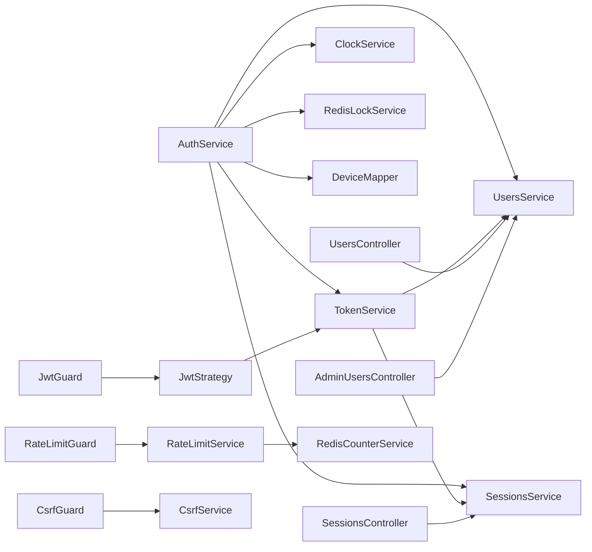

# Modules

This document describes each Nest module and how modules communicate.

## Root Modules

### AppModule

File: [src/app.module.ts](../src/app.module.ts)

Imports:

- `CoreModule`
- `InfrastructureModule`
- `FeaturesModule`

`AppModule` has no providers or controllers of its own. It exists as the composition root for the application.

### CoreModule

File: [src/core/core.module.ts](../src/core/core.module.ts)

Imports and exports:

- `ClockModule`

The core module currently exposes `ClockService` to the rest of the application.

### InfrastructureModule

File: [src/infrastructure/infrastructure.module.ts](../src/infrastructure/infrastructure.module.ts)

Imports:

- `EnvModule`
- `DatabasesModule`

Providers:

- Global `ValidationPipe`, using `VALIDATION_PIPE_OPTIONS`.
- Global `DataResponseInterceptor`.

This module owns cross-cutting HTTP and infrastructure setup.

### FeaturesModule

File: [src/features/features.module.ts](../src/features/features.module.ts)

Imports:

- `AuthModule`
- `SecurityModule`
- `SessionsModule`
- `TokenModule`
- `UsersModule`

It groups all feature modules into one module imported by `AppModule`.

## Infrastructure Modules

### EnvModule

Files:

- [src/infrastructure/config/env/env.module.ts](../src/infrastructure/config/env/env.module.ts)
- [src/infrastructure/config/env/env.schema.ts](../src/infrastructure/config/env/env.schema.ts)

Registers Nest `ConfigModule` globally. It loads `.env.${NODE_ENV}` and `.env`, validates required variables with Joi, and loads Redis and JWT config factories.

### DatabasesModule

File: [src/infrastructure/databases/databases.module.ts](../src/infrastructure/databases/databases.module.ts)

Imports:

- `PostgresModule`
- `RedisModule`

### PostgresModule

File: [src/infrastructure/databases/postgres/postgres.module.ts](../src/infrastructure/databases/postgres/postgres.module.ts)

Registers TypeORM with `TypeOrmModule.forRootAsync(postgresConfig.asProvider())`.

The PostgreSQL config builds a connection URL from:

- `DATA_SOURCE_USERNAME`
- `DATA_SOURCE_PASSWORD`
- `DATA_SOURCE_HOST`
- `DATA_SOURCE_PORT`
- `DATA_SOURCE_DATABASE`

### RedisModule

File: [src/infrastructure/databases/redis/redis.module.ts](../src/infrastructure/databases/redis/redis.module.ts)

Decorated with `@Global()`.

Providers:

- `redisProvider`: creates an `ioredis` client.
- `RedisService`: wraps basic Redis access and exposes the raw client.
- `RedisLockService`: key-expiry helper used by auth refresh flow.
- `RedisCounterService`: counter helper used by rate limiting.

Exports:

- `RedisLockService`
- `RedisCounterService`

`RedisService` itself is not exported by the module, but it is available inside the module and used by exported services.

## Feature Modules

### AuthModule

File: [src/features/auth/auth.module.ts](../src/features/auth/auth.module.ts)

Imports:

- `UsersModule`
- `SessionsModule`
- `TokenModule`
- `DeviceDetectionModule`
- `CsrfModule`

Controllers:

- `AuthController`

Providers:

- `AuthService`
- `HashingProvider` mapped to `BcryptProvider`

Important communication:

- Calls `UsersService` to register, authenticate, and update passwords.
- Calls `SessionsService` to create, rotate, and revoke sessions.
- Calls `TokenService` to issue and verify JWTs.
- Uses `DeviceMapper` to store a session-safe device object.
- Uses `ClockService` for session expiry.
- Uses `RedisLockService` during refresh.

### UsersModule

File: [src/features/users/users.module.ts](../src/features/users/users.module.ts)

Imports:

- `TypeOrmModule.forFeature([User])`

Controllers:

- `UsersController`
- `AdminUsersController`

Providers:

- `UsersService`

Exports:

- `UsersService`

The service uses `DataSource.getRepository(User)` rather than injecting a repository directly.

### SessionsModule

File: [src/features/sessions/sessions.module.ts](../src/features/sessions/sessions.module.ts)

Imports:

- `TypeOrmModule.forFeature([Session])`

Controllers:

- `SessionsController`

Providers:

- `SessionsService`

Exports:

- `SessionsService`

The service uses `DataSource.getRepository(Session)`.

### TokenModule

File: [src/features/token/token.module.ts](../src/features/token/token.module.ts)

Imports:

- `JwtModule.registerAsync(jwtConfig.asProvider())`
- `UsersModule`
- `SessionsModule`

Providers:

- `TokenService`

Exports:

- `TokenService`

`TokenService` signs and verifies JWTs and validates payloads by loading the user and active session.

### SecurityModule

File: [src/features/security/security.module.ts](../src/features/security/security.module.ts)

Imports:

- `JwtModule.registerAsync(jwtConfig.asProvider())`
- `TokenModule`
- `DeviceDetectionModule`
- `RateLimitModule`
- `CsrfModule`

Providers:

- `JwtStrategy`
- Global `GlobalExceptionFilter`
- Global `JwtGuard`
- Global `RolesGuard`

Exports:

- `DeviceDetectionModule`

Security submodules:

- `CsrfModule`: global CSRF guard and CSRF token service.
- `RateLimitModule`: global rate-limit guard and service.
- `DeviceDetectionModule`: middleware plus user-agent parsing and device mapping.

## Module Communication Summary

## Notable Circular Dependency Risk

`AuthModule` imports `TokenModule`, and `TokenModule` imports `UsersModule` and `SessionsModule`. This is currently resolved by Nest without `forwardRef()` because `TokenModule` does not import `AuthModule`. Keep this dependency direction in mind when adding auth-related providers.
