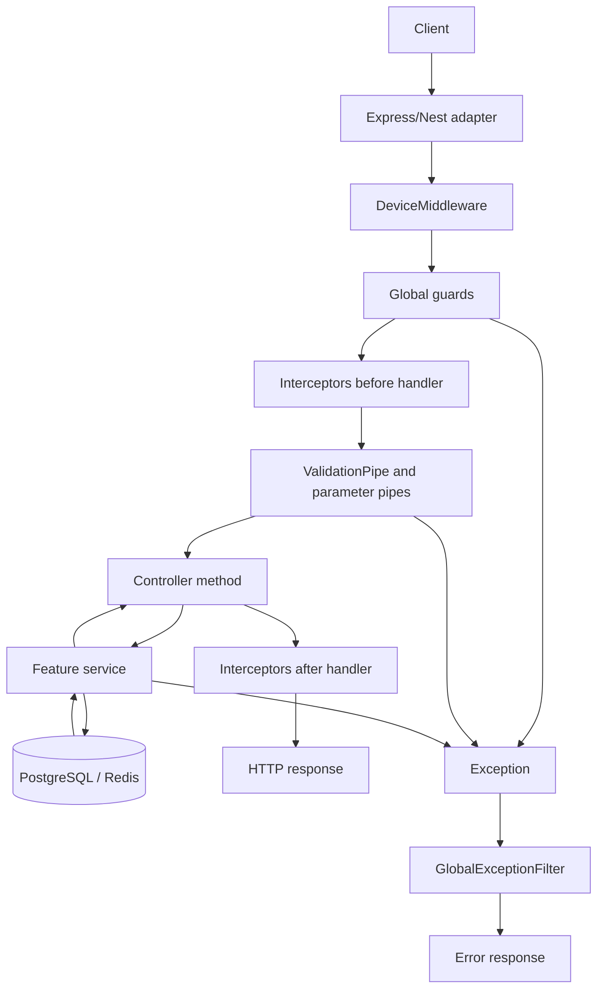

# Request Lifecycle

This document follows an HTTP request through the current NestJS application.

## Lifecycle Overview



## 1. Bootstrap Middleware

[setupApp()](../src/bootstrap.ts) registers:

- Helmet middleware.
- Compression middleware.
- Cookie parser.
- URI versioning.
- Swagger in development.

`DeviceDetectionModule` also applies `DeviceMiddleware` to all routes.

## 2. Device Middleware

File: [src/features/security/device-detection/device.middleware.ts](../src/features/security/device-detection/device.middleware.ts)

`DeviceMiddleware` calls `DeviceDetectorService.detect(req)` and assigns:

```ts
req.device = ...
```

The `@Device()` decorator later reads this value for login.

## 3. Global Guards

Global guards are registered through `APP_GUARD`.

### JwtGuard

Skips routes marked with `@Public()`. For all other routes:

1. Reads `access_token` cookie.
2. Verifies JWT through `JwtStrategy`.
3. Loads user and session through `TokenService`.
4. Attaches `request.user` and `request.session`.

### RolesGuard

Checks `@Roles()` metadata. If roles are required, it compares them against `request.user.role`.

### RateLimitGuard

Checks `@RateLimit()` metadata. If present, it increments a Redis counter for the route/IP pair.

### CsrfGuard

Allows safe methods and routes marked `@SkipCsrf()`. For unsafe methods, it compares `csrf_token` cookie to `x-csrf-token` header.

## 4. Interceptors

### DataResponseInterceptor

Global interceptor registered in `InfrastructureModule`.

Wraps successful responses as:

```json
{
  "data": "handler result"
}
```

### SerializeInterceptor

Applied per route by `@Serialize(Dto)`.

Uses `class-transformer` to expose only fields decorated with `@Expose()`.

### AuthCookieInterceptor

Applied to login and refresh routes.

After handler success, it sets:

- `access_token`
- `refresh_token`
- `csrf_token`

## 5. Pipes and DTO Validation

The global `ValidationPipe`:

- Whitelists DTO fields.
- Rejects non-whitelisted fields.
- Transforms incoming values.
- Uses implicit conversion.
- Returns `422` for validation errors.

DTO field decorators normalize email/username values and enforce password/username regex rules.

## 6. Controller

Controllers declare HTTP routes and delegate to services.

Examples:

- `AuthController.signInUser()` delegates to `AuthService.loginUser()`.
- `UsersController.changeProfile()` delegates to `UsersService.updateProfile()`.
- `SessionsController.terminateOthers()` delegates to `SessionsService.terminateOthers()`.

## 7. Services and Persistence

Services implement workflow logic and use:

- TypeORM `DataSource` repositories for PostgreSQL.
- Redis services for counters and refresh-flow keys.
- JWT service for token signing/verification.
- Hashing provider for passwords and refresh tokens.

## 8. Error Handling

`GlobalExceptionFilter` catches all exceptions.

It maps unknown exceptions through `ErrorMapper.from()` and returns:

```json
{
  "error": {
    "code": "...",
    "domain": "...",
    "message": "...",
    "meta": {},
    "path": "...",
    "timestamp": "..."
  }
}
```

Unknown errors are mapped to:

- HTTP `500`
- code `INTERNAL_ERROR`
- domain `SYSTEM`
- message `Unexpected error`
