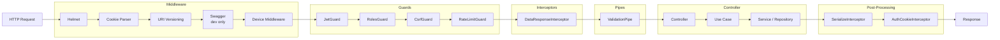

# Request Lifecycle

## Order of Execution

```
1. Bootstrap Middleware (Helmet, compression, cookie parser, URI versioning, Swagger)
2. DeviceMiddleware (parse User-Agent → attach req.device)
3. JwtGuard (global) — extract & validate access_token, attach req.user + req.session
4. RolesGuard (global) — check @Roles() metadata against user role
5. CsrfGuard (global) — validate X-CSRF-Token header for unsafe methods
6. RateLimitGuard (per-route) — check rate limit via Redis counter
7. DataResponseInterceptor (global) — wrap response in { data: ... }
8. ValidationPipe (global) — whitelist, forbidNonWhitelisted, transform, 422 on error
9. Controller — validate params, call use case
10. Use Case — orchestrate business logic
11. Service/Repository — data access, external calls
12. SerializeInterceptor (per-route) — strip non-@Expose fields
13. AuthCookieInterceptor (login/refresh) — set httpOnly cookies
14. Response sent to client
```

## Error Flow

Any exception thrown in steps 3–13 is caught by `GlobalExceptionFilter`:
- `AppError` → mapped to `{ error: { code, domain, message, meta, path, timestamp } }`
- Unknown errors → `500 INTERNAL_ERROR / SYSTEM`

## Detailed Chain


```mermaid
flowchart LR
    REQ[HTTP Request]

    subgraph Middleware
        H[Helmet]
        CP[Cookie Parser]
        UV[URI Versioning]
        SW[Swagger<br/>dev only]
        DM[Device Middleware]
    end

    subgraph Guards
        JG[JwtGuard]
        RG[RolesGuard]
        CG[CsrfGuard]
        RLG[RateLimitGuard]
    end

    subgraph Interceptors
        DRI[DataResponseInterceptor]
    end

    subgraph Pipes
        VP[ValidationPipe]
    end

    subgraph Controller
        C[Controller]
        UC[Use Case]
        S[Service / Repository]
    end

    subgraph Post-Processing
        SI[SerializeInterceptor]
        ACI[AuthCookieInterceptor]
    end

    REQ --> H --> CP --> UV --> SW --> DM
    DM --> JG --> RG --> CG --> RLG
    RLG --> DRI --> VP --> C
    C --> UC --> S
    S --> SI --> ACI --> RESP[Response]
```

## Global Registration

| Component | Registration | Module |
|-----------|-------------|--------|
| `ValidationPipe` | `APP_PIPE` | `PresentationModule` |
| `DataResponseInterceptor` | `APP_INTERCEPTOR` | `PresentationModule` |
| `JwtGuard` | `APP_GUARD` | `SecurityModule` |
| `RolesGuard` | `APP_GUARD` | `SecurityModule` |
| `CsrfGuard` | `APP_GUARD` | `SecurityModule` |
| `GlobalExceptionFilter` | `APP_FILTER` | `SecurityModule` |
| `DeviceMiddleware` | Global middleware | `DeviceDetectionModule` |

## Decorator-Based Registration

| Component | Registration |
|-----------|-------------|
| `RateLimitGuard` | `@RateLimit({ limit, ttl })` on controller/route |
| `SerializeInterceptor` | `@Serialize(Dto)` on controller method |
| `AuthCookieInterceptor` | `@UseInterceptors(AuthCookieInterceptor)` on login/refresh |

## Bypass Mechanisms

| Decorator | Effect |
|-----------|--------|
| `@Public()` | Bypasses `JwtGuard` (route accessible without authentication) |
| `@SkipCsrf()` | Bypasses `CsrfGuard` (no CSRF check for this route) |
