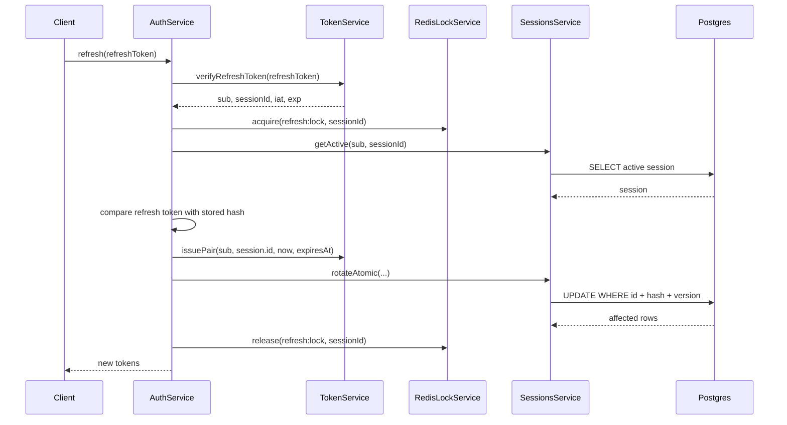

# Sessions

This document describes session persistence, session endpoints, and refresh-token rotation.

## Relevant Files

- [src/features/sessions/entities/session.entity.ts](../src/features/sessions/entities/session.entity.ts)
- [src/features/sessions/sessions.service.ts](../src/features/sessions/sessions.service.ts)
- [src/features/sessions/sessions.controller.ts](../src/features/sessions/sessions.controller.ts)
- [src/features/sessions/sessions.module.ts](../src/features/sessions/sessions.module.ts)
- [src/features/sessions/dto/response/session.response.dto.ts](../src/features/sessions/dto/response/session.response.dto.ts)
- [src/features/auth/auth.service.ts](../src/features/auth/auth.service.ts)
- [src/features/token/token.service.ts](../src/features/token/token.service.ts)

## Session Entity

The `Session` entity maps to the `session` table.

Fields:

| Field | Type | Purpose |
| --- | --- | --- |
| `id` | UUID | Primary key. |
| `refreshTokenHash` | string | Bcrypt hash of the current refresh token. |
| `device` | JSONB | Browser, OS, and device type snapshot. |
| `ipAddress` | string | IP address recorded at login. |
| `isRevoked` | boolean | Revocation flag. Defaults to `false`. |
| `expiresAt` | timestamp | Session expiry. |
| `lastUsedAt` | timestamp | Last auth/refresh activity timestamp. |
| `version` | number | Optimistic concurrency counter for refresh rotation. Defaults to `0`. |
| `rotatedAt` | timestamp nullable | Last refresh-token rotation timestamp. |
| `createdAt` | timestamp | TypeORM create timestamp. |
| `updatedAt` | timestamp | TypeORM update timestamp. |
| `owner` | `User` | Many-to-one relation to the user. |

## Session Creation

Sessions are created during login:

1. `AuthService.loginUser()` calls `ClockService.snapshot()` to get `now` and `expiresAt`.
2. Device data is mapped through `DeviceMapper.toSessionUserAgent()`.
3. `SessionsService.issue()` saves a new `Session`.
4. `TokenService.issuePair()` creates access and refresh JWTs.
5. The refresh token is hashed and stored through `SessionsService.updateRefreshState()`.

`SessionsService.issue()` initially stores a random UUID in `refreshTokenHash`; this is replaced by the real refresh token hash after tokens are issued.

## Active Session Lookup

`SessionsService.getActive(userId, sessionId)` requires:

- Matching session ID.
- Matching owner user ID.
- `isRevoked: false`.
- `expiresAt > new Date()`.

This lookup is used during access-token validation and refresh.

## Session Endpoints

Base path: `/v1/sessions`

| Method | Path | Description |
| --- | --- | --- |
| `GET` | `/v1/sessions` | List active sessions for the current user. |
| `DELETE` | `/v1/sessions` | Revoke the current session. |
| `DELETE` | `/v1/sessions/others` | Revoke all sessions except the current one. |

All session endpoints require authentication. `DELETE` endpoints also require CSRF validation.

## Listing Sessions

`SessionsService.list(userId, session)` returns:

- Current session first, with `current: true`.
- Other active non-revoked sessions for the same user.

The query selects only `device`, `expiresAt`, and `ipAddress` for other sessions. Because `SessionResponseDto` maps `sessionId` from `obj.id` and `lastActivityAt` from `obj.lastUsedAt`, other-session responses may lack these fields based on the current select list. This is a current implementation detail to review before relying on full session metadata in clients.

## Revocation

`SessionsService.revoke(userId, sessionId)` sets:

```ts
isRevoked: true
```

`SessionsService.terminateOthers(userId, sessionId)` revokes all sessions for the user except the current session.

Revoked sessions fail future `getActive()` checks. Existing access tokens become unusable once `JwtGuard` validates the payload and session.

Current limitation: revocation endpoints do not clear `access_token`, `refresh_token`, or `csrf_token` cookies in the HTTP response.

## Refresh Rotation

Refresh rotation happens in `AuthService.refresh()`.

Important checks:

1. Verify refresh JWT signature and expiry.
2. Load active session by `sub` and `sessionId`.
3. Compare presented refresh token with `session.refreshTokenHash`.
4. Reject if `session.rotatedAt` is at or after the refresh token `iat`.
5. Issue a new token pair.
6. Hash the new refresh token.
7. Atomically update the session if the old hash and version still match.

The database update in `SessionsService.rotateAtomic()` is the key concurrency protection:

```ts
.where('id = :id', { id: sessionId })
.andWhere('refreshTokenHash = :hash', { hash: oldHash })
.andWhere('version = :version', { version })
```

It also increments the version:

```ts
version: () => '"version" + 1'
```

If no row is affected, refresh fails with `SESSION_REUSE_DETECTED`.

## Redis Refresh Lock Helper

`AuthService.refresh()` also calls:

- `RedisLockService.acquire(RedisKey.REFRESH_LOCK, sessionId)`
- `RedisLockService.release(RedisKey.REFRESH_LOCK, sessionId)`

Current limitation: `RedisLockService.acquire()` calls `SET key value EX ttl` through `RedisService.setWithExpiry()`. It does not use `NX`, so concurrent callers can all set the key and receive `OK`. It should not be documented or treated as a strict distributed lock until this behavior changes.

## Refresh Sequence



## Session Errors

Defined in [src/features/sessions/errors/session-errors.ts](../src/features/sessions/errors/session-errors.ts):

- `SESSION_NOT_FOUND`
- `SESSION_EXPIRED`
- `SESSION_REVOKED`
- `REFRESH_RATE_LIMITED`
- `SESSION_REUSE_DETECTED`
